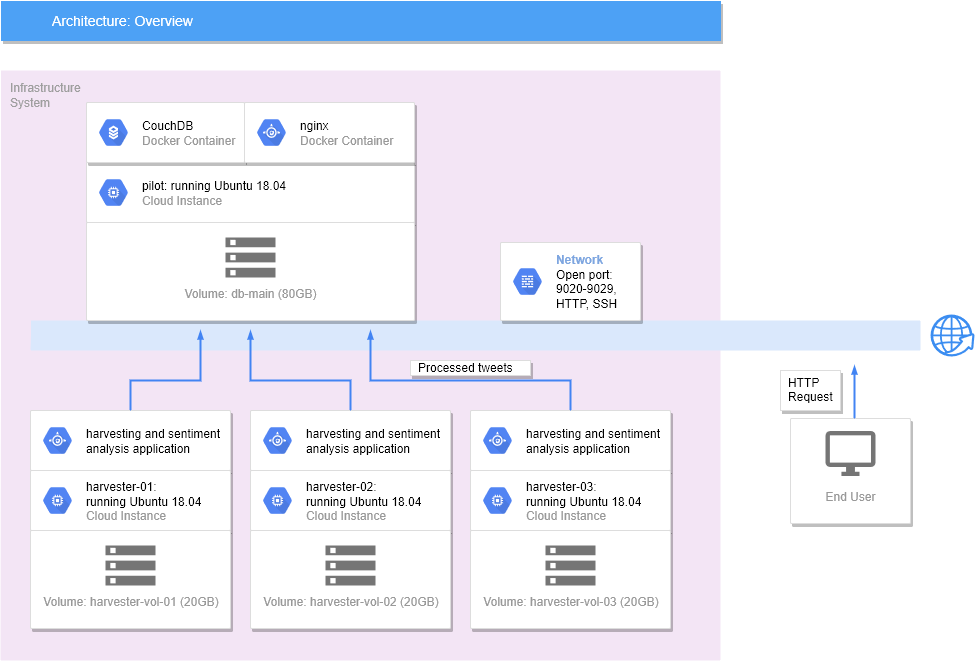

# Ansible Scripts for Deploying a Twitter Analysis Application  
*On the University of Melbourne Research Cloud (Openstack)*

## Architecture  

- One to many tweet-harvesters
- Single `CouchDB` instance running on Docker
- Web hosting using `nginx` running on Docker

## Folder structure

### Scripts for automatic deployment  
*Shell scripts that creates 4 instances and deploy the twitter analysis applications.*

- `src/_run_create.sh`: create instances according to the specification in `src/os-playbook/host_vars/main.yaml`.
- `src/_run_deploy.sh`: deploy applications (harvesters | sentiment analysis | database | webserver) on these instances.

### Ansible roles

All paths below are relative to `src/os-playbook/`.

- `host_deploy/`: self-contained playbooks for deployment of a single feature

  - | File Name under host_deploy | Purpose                                          |
    | --------------------------- | ------------------------------------------------ |
    | simple-apt.yaml             | install apt packages                             |
    | simple-aurin.yaml           | configure CouchDB views and populate AURIN data  |
    | simple-docker_*.yaml        | pull, create, start CouchDB and nginx containers |
    | simple-harvester.yaml       | run harvester script pulled from github          |
    | simple-mount.yaml           | create mount point and mount volumes             |
    | simple-proxy.yaml           | configure proxy in /etc/environment              |
    | vars_docker.yaml            | var file for playbooks in this folder            |

- `host_vars/`: variables used in `main.yaml`

  - `host_vars/uom.yaml`: specification for the instances created by `main.yaml`.

- `inventory/`: inventory file

  - `inventory/hosts.ini`: IPs of all 4 instances created.

- `roles/`: roles used in `mail.yaml`

- `main.yaml`: playbook for creating 4 instances according to specifications in `host_vars/uom.yaml`

- `authentication/`: [NOT uploaded] openstack authentication script and ssh privete key.

## Functionalities

Achieved *with Ansible automation*:

- [x] Create security groups for
  - [x] CouchDB access
- [x] Create instances on UoM cloud with
  - [x] network: qh2-uom-internal
  - [x] volumes: each instance will have a volume attached
- [ ] Get instance facts from UoM cloud as inventory list
- [x] Configure proxy settings on instances 
- [x] Install packages on instances
- [x] Set up CouchDB 
  - [x] As a single node instance
  - [x] With volumes for persistent storage
- [x] Run harvester script from Github repository on multiple instances

## Issues

- This solution requires manually filling host IPs in `infra/os-playbook/inventory/hosts.ini` after creating instances.
- The current deployment script cannot completely adapt to change of IP of the instance called `pilot` hosting CouchDB.  
  In case of such changes the following modules are affected:
  - In `src/os-playbook/host_deploy/simple-harvester.yaml`, the {{ remote_ip }} variable needs to be replaced accordingly.
  - `infra/os-playbook/host_deploy/simple-aurin.yaml` will not work for the new instance.
